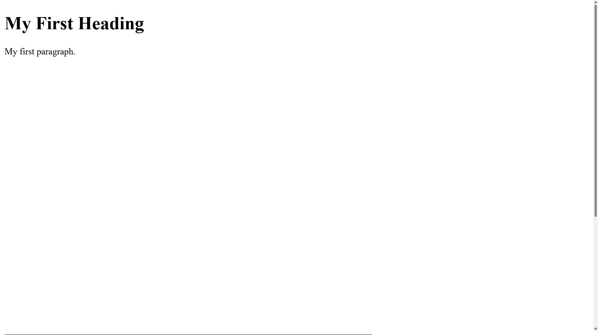
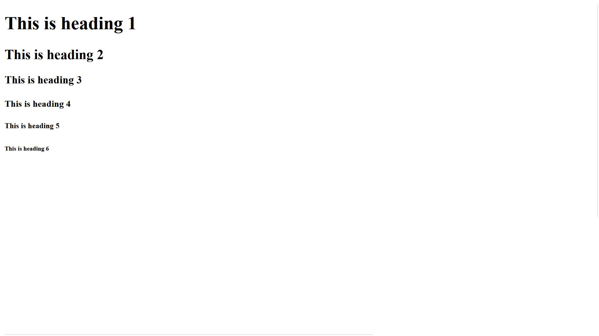
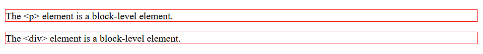
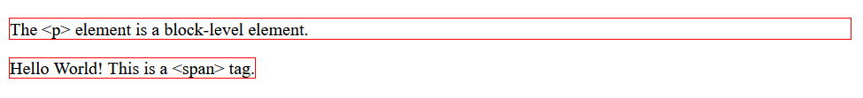
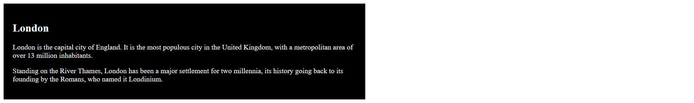
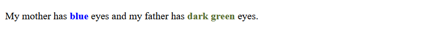

****

# 🎓 HTML Documentation

## 📌 What is HTML?

- HTML stands for **Hyper Text Markup Language**. It is the standard markup language used to create web pages and web applications. HTML describes the structure of a web page and its content, such as text, images, videos, and links.

## Basic HTML Structure

```html
<!DOCTYPE html>
<html lang="en">

<head>
  <meta charset="UTF-8">
  <meta name="viewport" content="width=device-width, initial-scale=1.0">
  <title>Page Title</title>
</head>

<body>

  <h1>My First Heading</h1>
  <p>My first paragraph.</p>

</body>

</html>
```

**📑 Explanation of the Structure**

Sure, here is the documentation formatted for easy copying:


## 📝 What is HTML?

HTML stands for **Hyper Text Markup Language**. It is the standard markup language used to create web pages and web applications. HTML describes the structure of a web page and its content, such as text, images, videos, and links.

## 📝 Basic HTML Structure

Here is an example of a basic HTML document structure:

```html
<!DOCTYPE html>
<html lang="en">

<head>
  <meta charset="UTF-8">
  <meta name="viewport" content="width=device-width, initial-scale=1.0">
  <title>Page Title</title>
</head>

<body>

  <h1>My First Heading</h1>
  <p>My first paragraph.</p>

</body>

</html>
```



### 📑 Explanation of the Structure

- `<!DOCTYPE html>`: This declaration defines the document type and version of HTML (HTML5 in this case).
- `<html lang="en">`: The root element of an HTML page, with the `lang` attribute specifying the language.
- `<head>`: Contains meta-information about the HTML document, such as character set, viewport settings, and the title of the document.
  - `<meta charset="UTF-8">`: Specifies the character encoding for the document.
  - `<meta name="viewport" content="width=device-width, initial-scale=1.0">`: Sets the viewport to make your web page responsive.
  - `<title>Page Title</title>`: Sets the title of the web page,

## 📝 What is an HTML Element?
An HTML element is defined by a start tag, some content, and an end tag:

`<tagname>` Content goes here... `</tagname>`
The HTML element is everything from the start tag to the end tag:

`<h1>`My First Heading`</h1>`

`<p>`My first paragraph.`</p>`

| Start tag | Element content     | End tag |
| --------- | ------------------- | ------- |
| `<h1>`      | My First Heading    | `</h1>`   |
| `<p>`       | My first paragraph. | `</p>`    |
| `<br>`      | none                | none    |

```
Note: Some HTML elements have no content (like the <br> element). These elements are called empty elements. Empty elements do not have an end tag!
```

## 📝 The <!DOCTYPE> Declaration

The `<!DOCTYPE>` declaration represents the document type, and helps browsers to display web pages correctly.

It must only appear once, at the top of the page (before any HTML tags).

The `<!DOCTYPE>` declaration is not case sensitive.

The `<!DOCTYPE>` declaration for HTML5 is:

```html
<!DOCTYPE html>
```

## 📝 HTML Headings
HTML headings are defined with the `<h1>` to `<h6>` tags.

`<h1>` defines the most important heading. `<h6>` defines the least important heading: 

```html
<!DOCTYPE html>
<html lang="en">

<head>
  <meta charset="UTF-8">
  <meta name="viewport" content="width=device-width, initial-scale=1.0">
  <title>Page Title</title>
</head>

<body>

  <h1>This is heading 1</h1>
  <h2>This is heading 2</h2>
  <h3>This is heading 3</h3>
  <h4>This is heading 4</h4>
  <h5>This is heading 5</h5>
  <h6>This is heading 6</h6>

</body>

</html>
```



## 📝 HTML Paragraphs

HTML paragraphs are defined with the <p> tag:

```html
<p>This is a paragraph.</p>
<p>This is another paragraph.</p>
```

## 📝 HTML Links

HTML links are defined with the `<a>` tag:

```html
<a href="https://www.google.com">This is a link</a>
```

The link's destination is specified in the `href` attribute. 

Attributes are used to provide additional information about HTML elements.

You will learn more about attributes in a later chapter.

## 📝 HTML Images
HTML images are defined with the `` tag.

The source file (`src`), alternative text (`alt`), `width`, and `height` are provided as attributes:

```html

```

## 📝 HTML Attributes
All HTML elements can have `attributes`
Attributes provide `additional information` about elements
Attributes are always specified in `the start tag`
Attributes usually come in name/value pairs like: `name="value"`

### The href Attribute
The `<a>` tag defines a hyperlink. The `href` attribute specifies the URL of the page the link goes to:

```html
<a href="https://github.com/webDev5464">Visit github</a>
```


****

- All HTML elements can have **attributes**
- The `href` attribute of `<a>` specifies the URL of the page the link goes to
- The `src` attribute of `` specifies the path to the image to be displayed
- The `width` and `height` attributes of `` provide size information for images
- The `alt` attribute of `` provides an alternate text for an image
- The `style` attribute is used to add styles to an element, such as color, font, size, and more
- The `lang` attribute of the `<html>` tag declares the language of the Web page
- The `title` attribute defines some extra information about an element
  
## 📝 Block and Inline Elements

### Block-level Elements

A block-level element always starts on a new line, and the browsers automatically add some space (a margin) before and after the element.

A block-level element always takes up the full width available (stretches out to the left and right as far as it can).

Two commonly used block elements are: `<p>` and `<div>`.

The `<p>` element defines a paragraph in an HTML document.

The `<div>` element defines a division or a section in an HTML document.

```html
<p>Hello World</p>
<div>Hello World</div>
```



- Here are the block-level elements in HTML:

```html
<address> <article> <aside> <blockquote> <canvas> <dd> <div> <dl> <dt> <fieldset> <figcaption> <figure> <footer> <form> <h1>-<h6> <header> <hr> <li> <main> <nav> <noscript> <ol> <p> <pre> <section> <table> <tfoot> <ul> <video>
```

### Inline Elements

An inline element does not start on a new line.

An inline element only takes up as much width as necessary.

```html
<span>Hello World</span>
```



` Here are the inline elements in HTML:

```html 
<a> <abbr> <b> <bdo> <br> <button> <cite> <code> <dfn> <em> <i>  <input> <kbd> <label> <map> <object> <output> <q> <samp> <script> <select> <small> <span> <strong> <sub> <sup> <textarea> <time> <tt> <var>
```

## 📝 The `<div>` Element

The `<div>` element is often used as a container for other HTML elements.

The `<div>` element has no required attributes, but `style`, `class` and `id` are common.

When used together with CSS, the `<div>` element can be used to style blocks of content:

```html
<div style="background-color:black; color:white;padding:20px; width: 50%;">
  <h2>London</h2>
  <p>London is the capital city of England. It is the most populous city in the United Kingdom, with a metropolitan
    area of over 13 million inhabitants.</p>
  <p>Standing on the River Thames, London has been a major settlement for two millennia, its history going back to its
    founding by the Romans, who named it Londinium.</p>
</div>
```



## 📝 The `<span>` Element

The `<span>` element is an inline container used to mark up a part of a text, or a part of a document.

The `<span>` element has no required attributes, but `style`, `class` and `id` are common.

When used together with CSS, the `<span>` element can be used to style parts of the text:

```html
<p>My mother has <span style="color:blue;font-weight:bold;">blue</span> eyes and my father has <span style="color:darkolivegreen;font-weight:bold;">dark green</span> eyes.</p>
```

